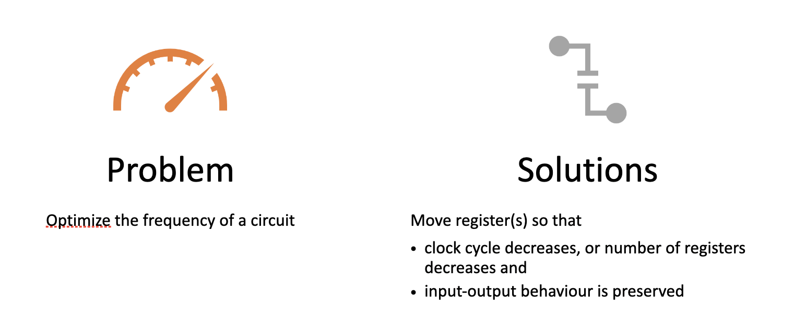
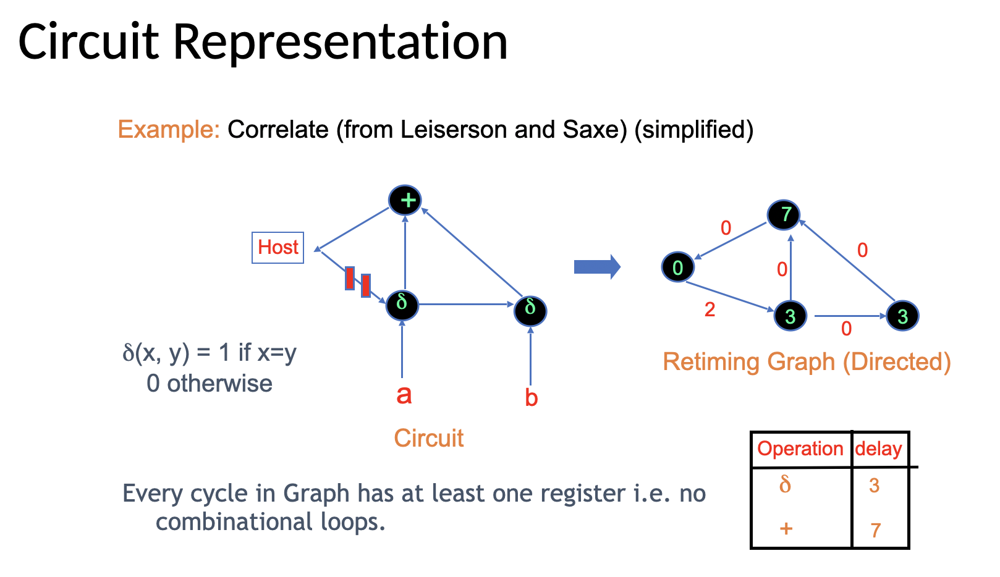
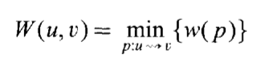

# Retiming Graph Algorithm

# Theory
A sequential circuit can be represented by a directed graph G(V,E), where each vertex *v* corresponds to a gate *v*.

Each directed edge e|*uv*, represents a flow of signal from the output of gate *u* at its source to the input of gate *v*.

Each edge has a weight w(e|*uv*,) which indicates the number of registers that the signal at the output of gate *u* must propagate through before it is available at the input of gate *v*.

Each vertex v has a constant delay d(v).

If there is an edge from vertex *u* to vertex *v*, u is called a fanin of *v* and *v* is called a fanout of *u*. 

A retiming is a labeling of the vertices r : V -> Z; where Z is the set of integers. The weight of an edge e|*uv* after retiming is denoted by wr(e|*uv*) and is given by 
wr(e|*uv*) = r(*v*) + w(e|*uv*) - r(*u*).

A positive (negative) retiming label r(*v*), for a vertex *v*, represents the number of registers, moved from its outputs (inputs) towards its inputs (outputs). A retiming of zero implies no movement of registers.

A path p is defined as a sequence of alternating vertices and edges, such that each successive vertex is a fanout of the previous vertex and the intermediate edge is directed from the former to the later. 

The weight of a path w(p) is the sum of the edge weights for the path. The delay of a path d(p) is the sum of the delays of the vertices on the path. A 0-weight path p, is a path with w(p)= 0.

## Matrices

We have the W and the D matrices, given by:

 

The matrices are defined for all pairs of vertices (u, v) such that v is reachable from u by a sequence of edges and the path does not include the host vertex.

An entry of the W matrix determines the minimum latency (in clock cycles) for data flowing from u to v.

An entity in the D matrix gives the maximum delay from u to v for the minimum latency.

W may be computed by solving the all-pairs shortest paths problem on the graph G using Dijkstras algorithm.

## Minimum period retiming
The objective is to obtain a circuit with the minimum clock period without any consideration to the area penalty due to an increase in the number of registers.